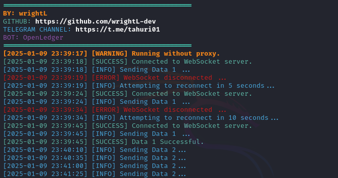

# BOT OPENLEDGER - EXTENSION



**Fitur:**

**• Auto Send Data**

**• Supports Proxy w/o Proxy**

**• Auto Connect Websocket and Reconnect If Error**

*Note: For now still single account, Multi-Account's still private, gonna be shared once scripts like this are all over GitHub.*

## Requirements

Before running this project, make sure you have installed:

- Node.js
- npm (Node Package Manager)

## Installation

1. **Clone this repository:**

    ```plaintext
    git clone https://github.com/wrightL-dev/OPENLEDGER
    cd OPENLEDGER

2. **Install the required packages:**

    ```plaintext
    npm install ws uuid https-proxy-agent moment-timezone

3. **Add bearer accounts in the akun.txt file. Example:**

    ```plaintext
   eyxxxxxxxxxxxxxxxxxxxxxxx

4. **Add your wallet OpenLedger in the wallet.txt file. Example:**
   ```plaintext
   0x8xxxxxxxxxxxxxxxxxxxxxx

*Note: Take your wallet from your profile dashboard*

5. **If you want to use a proxy, edit the proxy.txt file. Example:**
   ```plaintext
   http://username:password@ip_address:port
   
6. **Run the script:**
   ```plaintext
   node main.js
   
## Support

If you have any questions or need further assistance, feel free to join our Telegram channel at [t.me/tahuri01](https://t.me/tahuri01).

## License

This project is licensed under the [MIT License](LICENSE).
